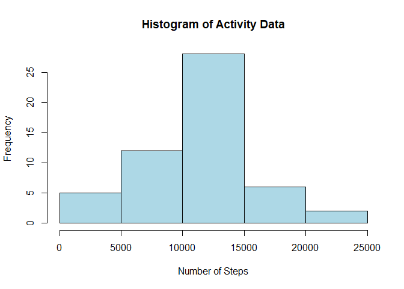
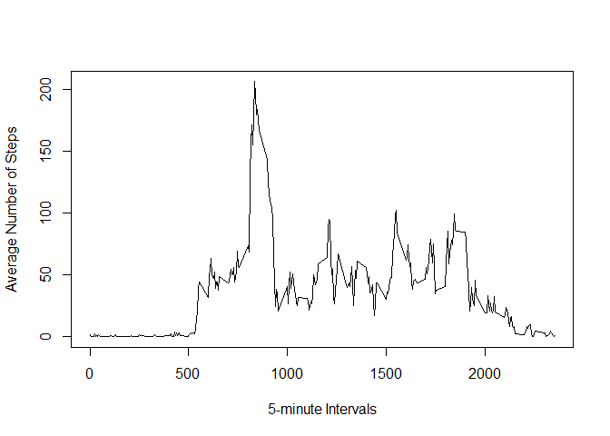
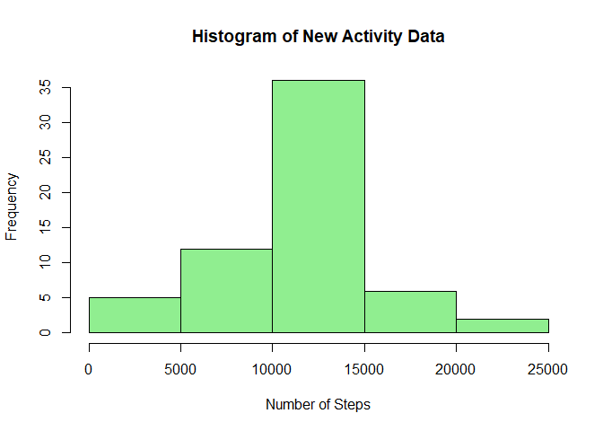
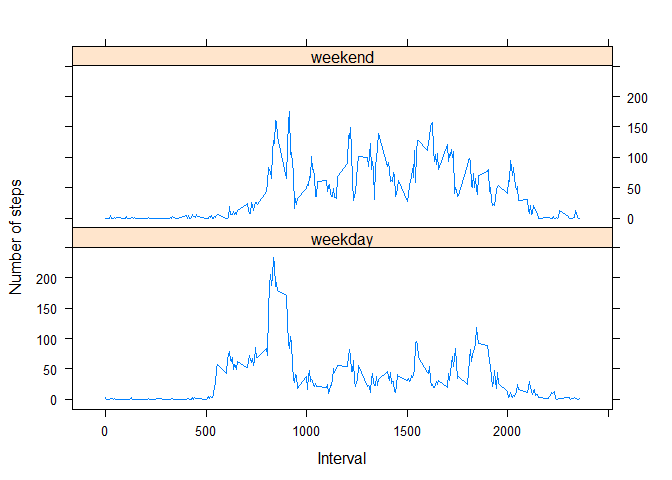

# Reproducible Research: Peer Assessment 1


## Loading and preprocessing the data

1. Load the data (i.e. read.csv())

```r
# Set path
setwd("D:/Courses/Data Science/Course 5 - Reproducible Research/Project 1/RepData_PeerAssessment1")

# Load data from zip file
activityData <- read.table(unz("activity.zip", "activity.csv"), header=T, quote="\"", sep=",")
```

2. Process/transform the data (if necessary) into a format suitable for your analysis

```r
# Convert date to proper format
activityData$date <- strptime(activityData$date, format="%Y-%m-%d")
```


## What is mean total number of steps taken per day?  

Ignore NAs for this step.

```r
validActivityData <- activityData[!is.na(activityData$steps),]
```

1. Calculate the total number of steps taken per day

```r
# Split according to dates and sum no. of steps.
dailySteps <- sapply(split(validActivityData$steps, as.Date(validActivityData$date)), sum)
dailySteps
```

```
## 2012-10-02 2012-10-03 2012-10-04 2012-10-05 2012-10-06 2012-10-07 
##        126      11352      12116      13294      15420      11015 
## 2012-10-09 2012-10-10 2012-10-11 2012-10-12 2012-10-13 2012-10-14 
##      12811       9900      10304      17382      12426      15098 
## 2012-10-15 2012-10-16 2012-10-17 2012-10-18 2012-10-19 2012-10-20 
##      10139      15084      13452      10056      11829      10395 
## 2012-10-21 2012-10-22 2012-10-23 2012-10-24 2012-10-25 2012-10-26 
##       8821      13460       8918       8355       2492       6778 
## 2012-10-27 2012-10-28 2012-10-29 2012-10-30 2012-10-31 2012-11-02 
##      10119      11458       5018       9819      15414      10600 
## 2012-11-03 2012-11-05 2012-11-06 2012-11-07 2012-11-08 2012-11-11 
##      10571      10439       8334      12883       3219      12608 
## 2012-11-12 2012-11-13 2012-11-15 2012-11-16 2012-11-17 2012-11-18 
##      10765       7336         41       5441      14339      15110 
## 2012-11-19 2012-11-20 2012-11-21 2012-11-22 2012-11-23 2012-11-24 
##       8841       4472      12787      20427      21194      14478 
## 2012-11-25 2012-11-26 2012-11-27 2012-11-28 2012-11-29 
##      11834      11162      13646      10183       7047
```

1. Make a histogram of the total number of steps taken each day

```r
# Draw histogram
hist(dailySteps, breaks = 5, col = "lightblue", xlab = "Number of Steps", main = "Histogram of Activity Data")
```

<!-- -->

1. Calculate and report the mean and median of the total number of steps taken per day

```r
# Mean & Median
mean(dailySteps); median(dailySteps)
```

```
## [1] 10766.19
```

```
## [1] 10765
```


## What is the average daily activity pattern?

1. Make a time series plot (i.e. type = "l") of the 5-minute interval (x-axis) and the average number of steps taken, averaged across all days (y-axis)  

```r
# Split according to intervals and calculate means. 
intervalStepMean <- sapply(split(validActivityData$steps, validActivityData$interval), mean)
intervals <- unique(validActivityData$interval)

plot(intervals, intervalStepMean, type="l", xlab="5-minute Intervals", ylab="Average Number of Steps")
```

<!-- -->

1. Which 5-minute interval, on average across all the days in the dataset, contains the maximum number of steps?

```r
# Re-format data
intervalData <- data.frame(names(intervalStepMean),as.numeric(unlist(intervalStepMean)))
names(intervalData)<-c("intervalNumber", "intervalStepMean")
# Interval with maximum number of steps
intervalData[which.max(intervalData[,2]),]
```

```
##     intervalNumber intervalStepMean
## 104            835         206.1698
```


## Imputing missing values

1. Calculate and report the total number of missing values in the dataset (i.e. the total number of rows with NAs)

```r
sum(is.na(activityData)) 
```

```
## [1] 2304
```

2. Devise a strategy for filling in all of the missing values in the dataset. The strategy does not need to be sophisticated. For example, you could use the mean/median for that day, or the mean for that 5-minute interval, etc.

```r
# Use ave() function to replace missing step values with interval average.
newSteps <- ave(activityData$steps, activityData$interval,FUN=function(x) replace(x,is.na(x),mean(x,na.rm=TRUE))) 
```

3. Create a new dataset that is equal to the original dataset but with the missing data filled in.

```r
# create new dataset
newActivityData <- activityData
newActivityData$steps <- newSteps
```

4. Make a histogram of the total number of steps taken each day.


```r
# Calculate new total steps per day
newDailySteps <- sapply(split(newActivityData$steps, as.Date(newActivityData$date)), sum, na.rm = TRUE)
newDailySteps
```

```
## 2012-10-01 2012-10-02 2012-10-03 2012-10-04 2012-10-05 2012-10-06 
##   10766.19     126.00   11352.00   12116.00   13294.00   15420.00 
## 2012-10-07 2012-10-08 2012-10-09 2012-10-10 2012-10-11 2012-10-12 
##   11015.00   10766.19   12811.00    9900.00   10304.00   17382.00 
## 2012-10-13 2012-10-14 2012-10-15 2012-10-16 2012-10-17 2012-10-18 
##   12426.00   15098.00   10139.00   15084.00   13452.00   10056.00 
## 2012-10-19 2012-10-20 2012-10-21 2012-10-22 2012-10-23 2012-10-24 
##   11829.00   10395.00    8821.00   13460.00    8918.00    8355.00 
## 2012-10-25 2012-10-26 2012-10-27 2012-10-28 2012-10-29 2012-10-30 
##    2492.00    6778.00   10119.00   11458.00    5018.00    9819.00 
## 2012-10-31 2012-11-01 2012-11-02 2012-11-03 2012-11-04 2012-11-05 
##   15414.00   10766.19   10600.00   10571.00   10766.19   10439.00 
## 2012-11-06 2012-11-07 2012-11-08 2012-11-09 2012-11-10 2012-11-11 
##    8334.00   12883.00    3219.00   10766.19   10766.19   12608.00 
## 2012-11-12 2012-11-13 2012-11-14 2012-11-15 2012-11-16 2012-11-17 
##   10765.00    7336.00   10766.19      41.00    5441.00   14339.00 
## 2012-11-18 2012-11-19 2012-11-20 2012-11-21 2012-11-22 2012-11-23 
##   15110.00    8841.00    4472.00   12787.00   20427.00   21194.00 
## 2012-11-24 2012-11-25 2012-11-26 2012-11-27 2012-11-28 2012-11-29 
##   14478.00   11834.00   11162.00   13646.00   10183.00    7047.00 
## 2012-11-30 
##   10766.19
```


```r
# Draw histogram
hist(newDailySteps, breaks = 5, col = "lightgreen", xlab = "Number of Steps", main = "Histogram of New Activity Data")
```

<!-- -->
Calculate and report the mean and median total number of steps taken per day. 

```r
# Mean & Median
mean(newDailySteps); median(newDailySteps)
```

```
## [1] 10766.19
```

```
## [1] 10766.19
```

Do these values differ from the estimates from the first part of the assignment? What is the impact of imputing missing data on the estimates of the total daily number of steps?  

**The mean of both the original and imputed datasets is same. Whereas the median values have increased from 10765 to 10766.19.
**


## Are there differences in activity patterns between weekdays and weekends?

1. Create a new factor variable in the dataset with two levels – “weekday” and “weekend” indicating whether a given date is a weekday or weekend day.

```r
weekend <- as.numeric(weekdays(validActivityData$date) %in% c("Saturday","Sunday"))
validActivityData$daytype <- c('weekday','weekend')[weekend+1L]
sapply(split(validActivityData$steps, validActivityData$daytype), mean, na.rm = TRUE)
```

```
##  weekday  weekend 
## 35.33796 43.07837
```
**Hence, mean value of steps taken over the weekend (43.07837) is more than the steps taken during the week (35.33796)**

2. Make a panel plot containing a time series plot (i.e. type = "l") of the 5-minute interval (x-axis) and the average number of steps taken, averaged across all weekday days or weekend days (y-axis).

```r
# Load lattice package
library(lattice)

# Use aggregate to calculate means accoding to interval and daytype 
newdata <- aggregate(steps ~ interval + daytype, data = validActivityData, mean)
names(newdata) <- c("interval", "daytype", "steps")

# Plot
xyplot(newdata$steps ~ newdata$interval | newdata$daytype, type='l', layout=c(1,2), xlab="Interval", ylab="Number of steps")
```

<!-- -->


